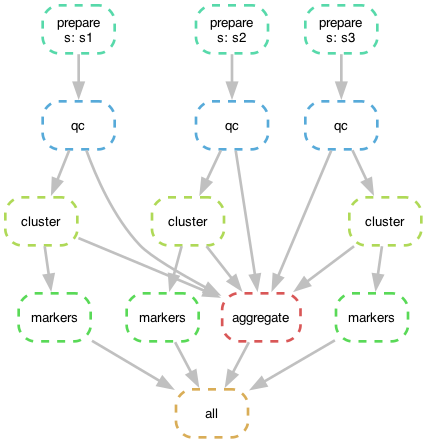
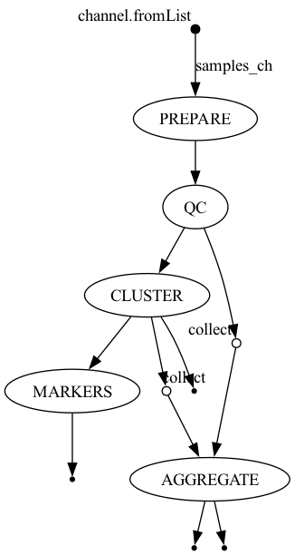

# scrna-workflow

The **same** multi-sample scRNA-seq pipeline written as a reproducible DAG in **both Snakemake and
Nextflow**, sharing one set of Python stage scripts. The point isn't the biology (a standard
QC → cluster → markers pass on pbmc3k) — it's the **workflow-engineering**: scatter a pipeline across
samples, gather the results, drive it from config, and get the exact same answer from either engine.

It's a deliberate side-by-side of the two dominant paradigms:
- **Snakemake** — *pull-based*: you declare each rule's output filename pattern, and Snakemake works
  backwards from the target to infer the DAG by matching inputs to outputs.
- **Nextflow** — *dataflow*: processes are wired together by channels and run as soon as their inputs
  arrive; `.collect()` is the synchronization barrier.

Only the orchestration layer differs — `scripts/` is identical for both.

## The pipeline (one scatter-gather DAG)

```
                 ┌── qc ── cluster ── markers ──┐   (per sample, in parallel = SCATTER)
 prepare(sample) ┤                              │
                 └── qc ── cluster ──────────────┴── aggregate   (waits for all samples = GATHER)
```

| Stage | Script | In → Out |
|---|---|---|
| prepare | `scripts/prepare.py` | (sample, fraction, seed) → `{sample}.h5ad` (a deterministic subsample of pbmc3k) |
| qc | `scripts/qc.py` | h5ad → filtered h5ad + per-sample QC metrics |
| cluster | `scripts/cluster.py` | filtered h5ad → normalize/HVG/PCA/Leiden/UMAP → clustered h5ad + summary + UMAP png |
| markers | `scripts/markers.py` | clustered h5ad → top-N marker genes per cluster (Wilcoxon) |
| aggregate | `scripts/aggregate.py` | **all** samples' metrics+summaries → one cohort table + bar plot |

`prepare → qc → cluster → markers` runs independently per sample (the scatter); `aggregate` is a fan-in
that cannot start until every sample finishes (the gather) — exactly the dependency a workflow engine
exists to track. Samples and parameters live in `config.yaml` (Snakemake) / `nextflow.config`
(Nextflow).

## The DAG, both ways

The two engines express the *same* dependency graph differently — Snakemake as a rule/file graph,
Nextflow as a channel graph:

| Snakemake (`--dag`) | Nextflow (`-with-dag`) |
|---|---|
|  |  |

(Snakemake's graph shows the three per-sample chains fanning into one `aggregate`; Nextflow's shows the
channels with two `collect` barriers feeding `AGGREGATE`.)

## Verified: both engines, identical results

Running each engine on the same config produces the same cohort summary:

| sample | cells before | cells after | median genes/cell | Leiden clusters |
|---|---|---|---|---|
| s1 | 2160 | 2154 | 817 | 9 |
| s2 | 1620 | 1617 | 815 | 10 |
| s3 | 1889 | 1884 | 816 | 9 |

(Cluster 0's top markers are LDHB/LTB/CD3D — T cells — so the biology is sane too.)

## Setup

```bash
cd scrna-workflow
conda create -p .venv python=3.11 -y
.venv/bin/pip install -r requirements.txt
# Nextflow + JVM + graphviz (not pip):
conda install -p .venv -c bioconda -c conda-forge nextflow openjdk=21 graphviz -y
```

## Run

**Snakemake** (from the repo root, with the env's python on PATH):

```bash
PATH=$PWD/.venv/bin:$PATH .venv/bin/snakemake -s workflow_snakemake/Snakefile --cores 4
# render the DAG:
PATH=$PWD/.venv/bin:$PATH .venv/bin/snakemake -s workflow_snakemake/Snakefile --dag \
  | .venv/bin/dot -Tpng > workflow_snakemake/dag.png
```

**Nextflow**:

```bash
export JAVA_HOME=$PWD/.venv/lib/jvm
PATH=$PWD/.venv/bin:$JAVA_HOME/bin:$PATH \
  nextflow run workflow_nextflow/main.nf -with-dag workflow_nextflow/dag.png
```

Snakemake writes to `results_snakemake/`, Nextflow to `results_nextflow/` (both gitignored).

## Layout

```
config.yaml                     # shared logical config (samples + params); Snakemake reads it directly
scripts/                        # engine-agnostic stage scripts (CLI: --input/--output/params)
  prepare.py qc.py cluster.py markers.py aggregate.py
workflow_snakemake/Snakefile    # Snakemake port  (+ dag.png, rulegraph.png)
workflow_nextflow/main.nf       # Nextflow port   (+ nextflow.config, dag.png)
requirements.txt
```

## Notes / honest caveats

- **`python` resolution**: both engines invoke `python` in a subshell, so run them with the env's
  `bin/` on `PATH` (as shown). Nextflow also needs `JAVA_HOME`.
- The "samples" are deterministic subsamples of one pbmc3k dataset (different seed/fraction per sample)
  so the demo is fast and fully reproducible with no large downloads; in a real run, `prepare` would
  point at each sample's CellRanger output instead.
- `config.yaml` and `nextflow.config` hold the same values in each engine's idiom and are kept in sync
  by hand — a single source of truth would be the next refactor.
